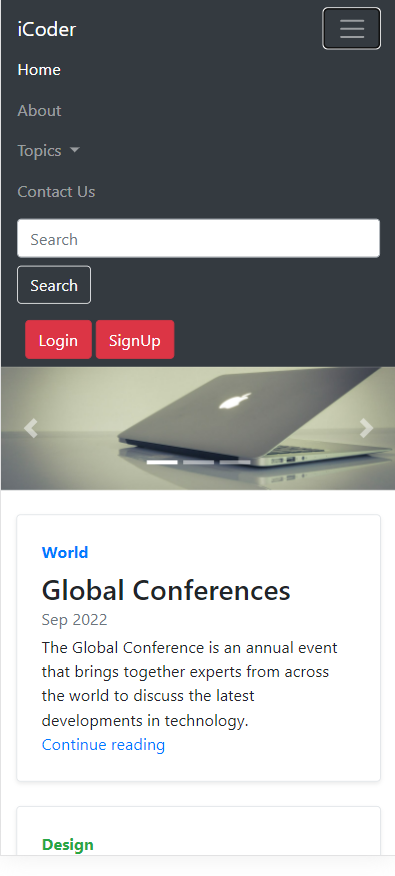

# Technical Blog Site

 Technical blog site is a website that provides users with technical information, resources, and support related to topics such as computer programming, web development, and technology. This type of blog typically covers topics such as coding, software development, hardware and software reviews, and industry news. It also provides an outlet for users to discuss their own technical projects and experiences. Technical blog sites are a great resource for those looking to stay up-to-date on the latest technology trends, learn about upcoming tech products, or simply connect with other tech enthusiasts. 

# Features
- __Mobile Responsive__:- Mobile Responsive design refers to a website that is designed to automatically adjust its layout and content according to the size of the device it is being viewed on. This ensures that the website looks and functions properly regardless of the type of device being used. 

- __Consistent Visuals__: A consistent visual design language that clearly communicates the brand and creates a consistent user experience.

- __Intuitive Navigation__: A user friendly navigation system that allows users to quickly find the page or content they are looking for.

- __Search Functionality__: A website that has a clearly visible search function that allows users to quickly find the content they are looking for.


- __Feedback__: A website that allows users to provide feedback and suggestions to help improve the user experience.


# Screenshots

- ## Home page


- ## About page


- ## Contact page


# Mobile View

- ## Home page


- ## Navigation bar



- ## About page


- ## Contact page


***
## Connect with me
<br>
<a href="https://linkedin.com/in/nileshkumargupta05/" target="blank"></a>
<a href="https://stackoverflow.com/users/20517271" target="blank"></a>
<a href="https://instagram.com/_nilesh2202" target="blank"></a>
<a href="https://www.hackerrank.com/guptanilesh417" target="blank"></a>
</p><br>


- [](mailto:guptanilesh417@gmail.com)


```python
print("Hello I am Nilesh🙋‍♂️.")
```
```python
print("Nice to meet you. see you soon")
```
```python
print("Show some ❤️ to my Repositories.")
```


- [Click to see __Website working__](https://nilesh220.github.io/Blog-website/ "website link")
    
